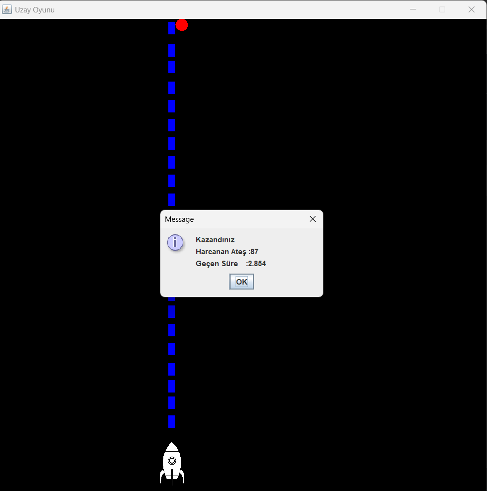

# 🚀 Java Space Game

A simple 2D space game. The player controls a spaceship, avoids asteroids, and tries to achieve the highest score.

## 🎮 Features
- Control the spaceship with keyboard  
- Collision detection system  
- Score counter  
- Simple animations and graphics (Swing / Java2D)  
- Basic game loop  

## ⚙️ Technologies Used
- Java SE  
- Swing  
- Java2D  

## ▶️ How to Run
1. Clone the repository:
   ```bash
   git clone https://github.com/TopcuogluTaner/UzayOyunu.git


# 🚀 Java Space Game

Basit bir 2D uzay oyunu. Oyuncu bir uzay gemisini kontrol ederek asteroidlerden kaçmaya ve en yüksek puanı toplamaya çalışır.

## 🎮 Özellikler
- Klavye ile uzay gemisini kontrol etme  
- Çarpışma algılama sistemi (collision detection)  
- Puan sayacı  
- Basit animasyonlar ve grafikler (Swing / Java2D)  
- Temel oyun döngüsü mantığı  

## ⚙️ Kullanılan Teknolojiler
- Java SE  
- Swing  
- Java2D  

## ▶️ Çalıştırma
1. Depoyu klonla:
   ```bash
   https://github.com/TopcuogluTaner/UzayOyunu.git

   
